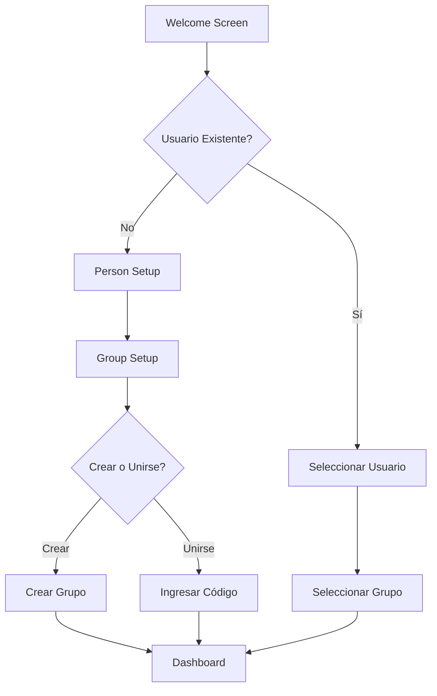
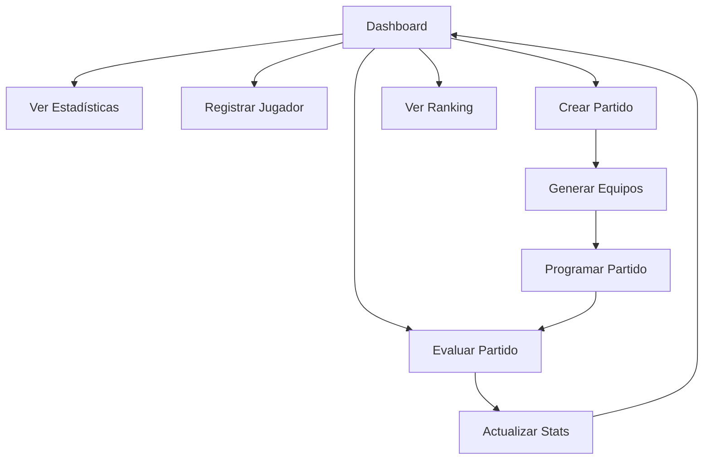

# 📋 AUDITORÍA COMPLETA - FC24 TEAM MANAGER
## Documentación de Flujo, Análisis y Mejoras
### Fecha: 30 de Agosto, 2025

---

## 📊 ÍNDICE
1. [Resumen Ejecutivo](#resumen-ejecutivo)
2. [Flujo Completo de Usuario](#flujo-completo-de-usuario)
3. [Análisis por Pantalla](#análisis-por-pantalla)
4. [Mejoras Visuales Identificadas](#mejoras-visuales-identificadas)
5. [Mejoras de Implementación](#mejoras-de-implementación)
6. [Bugs Encontrados](#bugs-encontrados)
7. [Checklist de Verificación](#checklist-de-verificación)

---

## 🎯 RESUMEN EJECUTIVO

### Estado Actual
- **Versión**: 2.3.0
- **Funcionalidades Core**: ✅ Funcionando
- **Sistema de Grupos**: ✅ Implementado
- **Sistema de Evaluación**: ✅ Rediseñado
- **Dashboard**: ✅ Recién mejorado
- **Responsive**: ⚠️ Parcialmente implementado

### Principales Problemas
1. Inconsistencia visual entre pantallas
2. Falta de feedback visual en algunas acciones
3. Navegación no siempre intuitiva
4. Algunos elementos no son 100% responsive
5. Falta de validaciones en formularios

---

## 🔄 FLUJO COMPLETO DE USUARIO

### A. FLUJO DE PRIMER USO


### B. FLUJO PRINCIPAL (Usuario Registrado)


---

## 🖥️ ANÁLISIS POR PANTALLA

### 1. WELCOME SCREEN (index.html:166-260)
**Propósito**: Pantalla inicial para login o registro

#### ✅ Funciona Bien:
- Diseño limpio y profesional
- Logo y branding consistente
- Opciones claras de acción

#### ❌ Problemas:
- No hay indicador de carga al buscar usuarios
- Falta animación de transición
- No hay opción de "recordarme"
- El botón "Nuevo Usuario" podría ser más prominente

#### 🎨 Mejoras Visuales Sugeridas:
```css
/* Agregar efecto de loading */
.loading-overlay {
    position: absolute;
    top: 0;
    left: 0;
    right: 0;
    bottom: 0;
    background: rgba(0, 0, 0, 0.8);
    display: flex;
    align-items: center;
    justify-content: center;
    z-index: 9999;
}

/* Botón más prominente */
.btn-primary-large {
    padding: 15px 30px;
    font-size: 1.1rem;
    box-shadow: 0 4px 15px rgba(0, 255, 157, 0.3);
}
```

---

### 2. DASHBOARD (index.html:263-353)
**Propósito**: Vista principal con resumen y acciones rápidas

#### ✅ Funciona Bien:
- Nuevo diseño más útil (recién implementado)
- Información relevante y accionable
- Cards bien organizadas

#### ❌ Problemas:
- Falta skeleton loading mientras carga datos
- No hay refresh manual
- Los botones de acción podrían tener tooltips
- Falta indicador de "sin datos" más visual

#### 🎨 Mejoras Visuales Sugeridas:
```css
/* Skeleton loading */
.skeleton {
    background: linear-gradient(90deg, #1a1a1a 25%, #2a2a2a 50%, #1a1a1a 75%);
    background-size: 200% 100%;
    animation: loading 1.5s infinite;
}

@keyframes loading {
    0% { background-position: 200% 0; }
    100% { background-position: -200% 0; }
}

/* Tooltips */
.tooltip {
    position: relative;
}

.tooltip::after {
    content: attr(data-tooltip);
    position: absolute;
    bottom: 100%;
    left: 50%;
    transform: translateX(-50%);
    background: black;
    color: white;
    padding: 5px 10px;
    border-radius: 5px;
    white-space: nowrap;
    opacity: 0;
    pointer-events: none;
    transition: opacity 0.3s;
}

.tooltip:hover::after {
    opacity: 1;
}
```

---

### 3. REGISTRO DE JUGADORES (index.html:356-491)
**Propósito**: Formulario para agregar nuevos jugadores

#### ✅ Funciona Bien:
- Formulario completo con todos los campos
- Upload de foto funcional
- Sliders para atributos

#### ❌ Problemas:
- Los sliders no muestran valor actual claramente
- No hay preview del OVR mientras ajustas stats
- Falta validación de nombre duplicado
- No hay botón de "reset" formulario
- La foto no se puede cambiar una vez subida

#### 🔧 Mejoras de Implementación:
```javascript
// Mostrar valor en tiempo real
function updateSliderValue(sliderId) {
    const slider = document.getElementById(sliderId);
    const valueDisplay = document.getElementById(`${sliderId}-value`);
    valueDisplay.textContent = slider.value;
    updateOVRPreview();
}

// Preview OVR
function updateOVRPreview() {
    const pac = parseInt(document.getElementById('pac').value);
    const sho = parseInt(document.getElementById('sho').value);
    const pas = parseInt(document.getElementById('pas').value);
    const dri = parseInt(document.getElementById('dri').value);
    const def = parseInt(document.getElementById('def').value);
    const phy = parseInt(document.getElementById('phy').value);
    
    const ovr = Math.round((pac + sho + pas + dri + def + phy) / 6);
    document.getElementById('ovr-preview').textContent = ovr;
}
```

---

### 4. GESTIÓN DE JUGADORES (Vista Lista)
**Propósito**: Ver y administrar jugadores registrados

#### ✅ Funciona Bien:
- Cards de jugadores visualmente atractivas
- Modo edición/eliminación
- Búsqueda y filtrado

#### ❌ Problemas:
- No hay confirmación visual al eliminar
- Falta ordenamiento (por OVR, nombre, posición)
- No hay bulk actions (eliminar varios)
- El modo edición no es obvio
- Falta paginación para muchos jugadores

#### 🎨 Mejoras Visuales Sugeridas:
```css
/* Confirmación de eliminación */
.delete-confirm {
    animation: shake 0.5s;
}

@keyframes shake {
    0%, 100% { transform: translateX(0); }
    25% { transform: translateX(-10px); }
    75% { transform: translateX(10px); }
}

/* Indicador de modo edición */
.edit-mode-active {
    border: 2px solid var(--primary-color);
    box-shadow: 0 0 20px rgba(0, 255, 157, 0.3);
}
```

---

### 5. GENERACIÓN DE EQUIPOS (Matches Screen)
**Propósito**: Crear equipos balanceados para partidos

#### ✅ Funciona Bien:
- Algoritmo de balance funciona
- Muestra OVR de cada equipo
- Permite diferentes formatos (5v5, 7v7, 11v11)

#### ❌ Problemas:
- No se pueden intercambiar jugadores manualmente
- No hay opción de "regenerar" con diferentes criterios
- Falta preview de formación
- No guarda equipos favoritos
- El botón "Programar Partido" a veces no aparece

#### 🔧 Mejoras de Implementación:
```javascript
// Drag & Drop para intercambiar jugadores
function enableDragAndDrop() {
    const players = document.querySelectorAll('.player-card');
    players.forEach(player => {
        player.draggable = true;
        player.addEventListener('dragstart', handleDragStart);
        player.addEventListener('dragover', handleDragOver);
        player.addEventListener('drop', handleDrop);
    });
}

// Guardar equipos favoritos
function saveTeamPreset(teamA, teamB, name) {
    const presets = JSON.parse(localStorage.getItem('teamPresets') || '[]');
    presets.push({
        name,
        teamA,
        teamB,
        date: new Date().toISOString()
    });
    localStorage.setItem('teamPresets', JSON.stringify(presets));
}
```

---

### 6. SISTEMA DE EVALUACIÓN (index.html:2178-2340)
**Propósito**: Evaluar desempeño de jugadores post-partido

#### ✅ Funciona Bien:
- Tags de rendimiento rediseñados
- Sistema de puntuación 1-10
- Actualiza estadísticas

#### ❌ Problemas:
- No se puede editar evaluación una vez guardada
- Falta resumen antes de confirmar
- No hay MVP automático
- Los tags no tienen descripción/tooltip
- No hay validación de al menos un tag por jugador

#### 🎨 Mejoras Visuales Sugeridas:
```css
/* MVP Badge */
.mvp-badge {
    position: absolute;
    top: -10px;
    right: -10px;
    background: gold;
    color: black;
    padding: 5px 10px;
    border-radius: 20px;
    font-weight: bold;
    animation: pulse 2s infinite;
}

@keyframes pulse {
    0%, 100% { transform: scale(1); }
    50% { transform: scale(1.1); }
}

/* Tag descriptions */
.tag-tooltip {
    position: absolute;
    background: rgba(0, 0, 0, 0.9);
    padding: 8px;
    border-radius: 5px;
    font-size: 0.8rem;
    white-space: nowrap;
    z-index: 1000;
}
```

---

### 7. ESTADÍSTICAS Y RANKING
**Propósito**: Ver estadísticas globales y ranking de jugadores

#### ✅ Funciona Bien:
- Tabla de ranking clara
- Estadísticas por jugador

#### ❌ Problemas:
- No hay gráficos de evolución
- Falta exportar a PDF/Excel
- No hay filtros por fecha
- Falta comparación entre jugadores
- No hay estadísticas de equipo

---

## 🎨 MEJORAS VISUALES IDENTIFICADAS

### PRIORIDAD ALTA 🔴
1. **Consistencia de Colores**
   - Establecer paleta consistente
   - Usar variables CSS en toda la app
   ```css
   :root {
       --primary: #00ff9d;
       --secondary: #00cc7d;
       --danger: #ff4444;
       --warning: #ffaa00;
       --success: #00ff9d;
       --dark-bg: #0a0a0a;
       --card-bg: #1a1a1a;
       --border: rgba(255, 255, 255, 0.1);
   }
   ```

2. **Loading States**
   - Skeleton screens para todas las secciones
   - Spinners consistentes
   - Progress bars para operaciones largas

3. **Feedback Visual**
   - Animaciones de confirmación
   - Tooltips informativos
   - Estados hover mejorados

### PRIORIDAD MEDIA 🟡
1. **Transiciones**
   - Entre pantallas
   - En cambios de estado
   - Al aparecer/desaparecer elementos

2. **Empty States**
   - Ilustraciones o iconos
   - Mensajes claros
   - Call-to-action

3. **Dark Mode Optimization**
   - Mejorar contrastes
   - Ajustar sombras
   - Optimizar legibilidad

### PRIORIDAD BAJA 🟢
1. **Micro-interacciones**
   - Botones con feedback
   - Inputs con animación
   - Cards con efectos 3D

2. **Iconografía**
   - Iconos más consistentes
   - Agregar más iconos contextuales
   - Considerar icon fonts custom

---

## 🔧 MEJORAS DE IMPLEMENTACIÓN

### PRIORIDAD ALTA 🔴

1. **Validaciones de Formularios**
```javascript
class FormValidator {
    static validatePlayerName(name) {
        if (!name || name.trim().length < 3) {
            return { valid: false, message: 'Nombre debe tener al menos 3 caracteres' };
        }
        if (Storage.playerNameExists(name)) {
            return { valid: false, message: 'Ya existe un jugador con ese nombre' };
        }
        return { valid: true };
    }
    
    static validateEmail(email) {
        const regex = /^[^\s@]+@[^\s@]+\.[^\s@]+$/;
        return regex.test(email);
    }
}
```

2. **Error Handling Global**
```javascript
window.addEventListener('unhandledrejection', event => {
    console.error('Unhandled promise rejection:', event.reason);
    UI.showNotification('Ha ocurrido un error inesperado', 'error');
});

class ErrorHandler {
    static handle(error, context) {
        console.error(`Error in ${context}:`, error);
        
        // Log to service (future implementation)
        this.logError(error, context);
        
        // Show user-friendly message
        const message = this.getUserMessage(error);
        UI.showNotification(message, 'error');
    }
    
    static getUserMessage(error) {
        const messages = {
            'NetworkError': 'Error de conexión. Verifica tu internet.',
            'ValidationError': 'Datos inválidos. Revisa el formulario.',
            'NotFoundError': 'No se encontró el recurso solicitado.',
            'PermissionError': 'No tienes permisos para esta acción.'
        };
        
        return messages[error.name] || 'Ha ocurrido un error. Intenta nuevamente.';
    }
}
```

3. **Cache Management**
```javascript
class CacheManager {
    static readonly CACHE_DURATION = 5 * 60 * 1000; // 5 minutes
    
    static set(key, data) {
        const cacheData = {
            data,
            timestamp: Date.now()
        };
        localStorage.setItem(`cache_${key}`, JSON.stringify(cacheData));
    }
    
    static get(key) {
        const cached = localStorage.getItem(`cache_${key}`);
        if (!cached) return null;
        
        const { data, timestamp } = JSON.parse(cached);
        if (Date.now() - timestamp > this.CACHE_DURATION) {
            this.delete(key);
            return null;
        }
        
        return data;
    }
    
    static delete(key) {
        localStorage.removeItem(`cache_${key}`);
    }
    
    static clear() {
        Object.keys(localStorage)
            .filter(key => key.startsWith('cache_'))
            .forEach(key => localStorage.removeItem(key));
    }
}
```

### PRIORIDAD MEDIA 🟡

1. **Optimización de Rendimiento**
   - Lazy loading de imágenes
   - Debounce en búsquedas
   - Virtual scrolling para listas largas
   - Code splitting

2. **PWA Completa**
   - Service Worker para offline
   - Manifest actualizado
   - Push notifications
   - Install prompt

3. **Internacionalización**
   - Sistema de traducciones
   - Formatos de fecha/número
   - Soporte multi-idioma

### PRIORIDAD BAJA 🟢

1. **Analytics**
   - Tracking de eventos
   - Métricas de uso
   - Performance monitoring

2. **Testing**
   - Unit tests
   - Integration tests
   - E2E tests

---

## 🐛 BUGS ENCONTRADOS

### CRÍTICOS 🔴
1. **[BUG-001]** App.js no se inicializa si Firebase falla
   - **Ubicación**: index.html:953
   - **Solución**: Agregar fallback y retry logic

2. **[BUG-002]** Pérdida de datos al cambiar de grupo rápidamente
   - **Ubicación**: firebase-simple.js:1084
   - **Solución**: Implementar debounce y confirmación

### IMPORTANTES 🟡
3. **[BUG-003]** Dashboard no actualiza después de evaluar partido
   - **Ubicación**: app.js:2700
   - **Solución**: Refresh datos después de navegación

4. **[BUG-004]** Fotos de jugadores no se borran de Supabase al eliminar
   - **Ubicación**: firebase-simple.js:654
   - **Solución**: Agregar limpieza de storage

5. **[BUG-005]** Modo edición se mantiene al cambiar de pantalla
   - **Ubicación**: ui.js:439
   - **Solución**: Reset estado al navegar

### MENORES 🟢
6. **[BUG-006]** Tooltips se quedan visibles al hacer scroll rápido
7. **[BUG-007]** Animaciones se superponen en móvil
8. **[BUG-008]** Contador de miembros no se actualiza en tiempo real

---

## ✅ CHECKLIST DE VERIFICACIÓN

### 🏠 PANTALLA DE BIENVENIDA
- [ ] Logo se muestra correctamente
- [ ] Animación de entrada funciona
- [ ] Lista de usuarios existentes carga
- [ ] Botón "Nuevo Usuario" funciona
- [ ] Selección de usuario navega correctamente
- [ ] Responsive en móvil
- [ ] Sin errores en consola

### 📊 DASHBOARD
- [ ] Mensaje de bienvenida muestra nombre correcto
- [ ] Grupo actual se muestra
- [ ] Próximo partido carga o muestra "sin partidos"
- [ ] Últimos partidos se muestran correctamente
- [ ] Top performers calcula bien
- [ ] Estadísticas son precisas
- [ ] Botones de acción funcionan
- [ ] Responsive en móvil
- [ ] Sin errores en consola

### 👤 REGISTRO DE JUGADORES
- [ ] Formulario completo visible
- [ ] Upload de foto funciona
- [ ] Preview de foto se muestra
- [ ] Sliders de atributos funcionan
- [ ] OVR se calcula correctamente
- [ ] Validación de campos funciona
- [ ] Guardado exitoso
- [ ] Notificación de éxito aparece
- [ ] Formulario se limpia después de guardar
- [ ] Responsive en móvil

### 👥 GESTIÓN DE JUGADORES
- [ ] Lista de jugadores carga
- [ ] Cards muestran info completa
- [ ] Fotos se cargan correctamente
- [ ] Búsqueda funciona
- [ ] Filtros funcionan
- [ ] Modo edición se activa/desactiva
- [ ] Editar jugador funciona
- [ ] Eliminar jugador funciona (con confirmación)
- [ ] Paginación funciona (si hay muchos)
- [ ] Responsive en móvil

### ⚽ GENERACIÓN DE EQUIPOS
- [ ] Selección de formato funciona
- [ ] Jugadores disponibles se muestran
- [ ] Selección de jugadores funciona
- [ ] Generación de equipos balancea correctamente
- [ ] OVR de equipos se muestra
- [ ] Diferencia de OVR es mínima
- [ ] Botón "Programar Partido" aparece
- [ ] Programar partido guarda correctamente
- [ ] Responsive en móvil

### 📝 EVALUACIÓN DE PARTIDOS
- [ ] Lista de partidos pendientes carga
- [ ] Selección de partido funciona
- [ ] Jugadores de ambos equipos se muestran
- [ ] Input de marcador funciona
- [ ] Tags de rendimiento son seleccionables
- [ ] Calificación 1-10 funciona
- [ ] Guardado actualiza estadísticas
- [ ] Navegación post-guardado funciona
- [ ] Responsive en móvil

### 📈 ESTADÍSTICAS
- [ ] Tabla de ranking carga
- [ ] Orden por OVR correcto
- [ ] Estadísticas individuales precisas
- [ ] Partidos jugados correcto
- [ ] Goles/Asistencias se muestran
- [ ] Filtros funcionan
- [ ] Exportar funciona (si implementado)
- [ ] Responsive en móvil

### 🔧 CONFIGURACIÓN
- [ ] Menú de persona se abre
- [ ] Cambiar grupo funciona
- [ ] Editar perfil funciona
- [ ] Gestión de grupo funciona (si es admin)
- [ ] Exportar datos funciona
- [ ] Cerrar sesión funciona
- [ ] Responsive en móvil

### 🌐 GENERAL
- [ ] Sin errores en consola
- [ ] Firebase conecta correctamente
- [ ] Datos persisten al recargar
- [ ] Navegación del footer funciona
- [ ] Notificaciones se muestran correctamente
- [ ] App funciona offline (parcialmente)
- [ ] Performance aceptable (<3s carga inicial)
- [ ] Accesibilidad básica (navegación teclado)

---

## 📋 PLAN DE ACCIÓN SUGERIDO

### FASE 1: Fixes Críticos (1-2 días)
1. Corregir bugs críticos
2. Implementar validaciones faltantes
3. Agregar error handling global
4. Mejorar feedback visual básico

### FASE 2: Mejoras UX (3-4 días)
1. Implementar loading states
2. Agregar tooltips y ayudas
3. Mejorar transiciones
4. Optimizar responsive

### FASE 3: Features Nuevas (5-7 días)
1. Sistema de MVP automático
2. Exportar estadísticas
3. Equipos favoritos
4. Comparación de jugadores
5. Gráficos de evolución

### FASE 4: Optimización (2-3 días)
1. Performance optimization
2. PWA completa
3. Testing
4. Documentación usuario final

---

## 📝 NOTAS FINALES

### Prioridades Recomendadas
1. **Estabilidad**: Corregir bugs críticos primero
2. **Usabilidad**: Mejorar feedback y validaciones
3. **Visual**: Consistencia y pulido
4. **Features**: Nuevas funcionalidades

### Métricas de Éxito
- 0 errores críticos en producción
- <3s tiempo de carga inicial
- 100% responsive en dispositivos comunes
- >90% de acciones con feedback visual
- Documentación completa para usuarios

---

*Documento creado: 30/08/2025*  
*Última actualización: 30/08/2025*  
*Versión: 1.0*