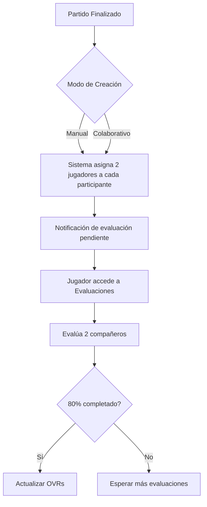

# Análisis: Unificación del Sistema de Evaluaciones

## 📋 Situación Actual

### Modos de Creación de Partidos
1. **Modo Manual (Tradicional)**
   - Un organizador crea y gestiona el partido
   - Control total sobre convocatoria y equipos
   - El organizador evalúa a todos los jugadores

2. **Modo Colaborativo**
   - Los jugadores se auto-organizan
   - Sin figura de organizador central
   - Cada jugador evalúa a 2 compañeros aleatorios

### Sistemas de Evaluación Actuales
- **Manual**: Organizador evalúa con etiquetas o modo simplificado
- **Colaborativo**: Jugadores evalúan automáticamente a 2 compañeros

## 🎯 Propuesta de Unificación

### Objetivo
Mantener ambos modos de crear partidos pero **unificar el sistema de evaluación** para que siempre sea:
- **Automático**: Cada jugador evalúa 2 compañeros aleatorios
- **Anónimo**: Nadie sabe quién lo evaluó
- **Centralizado**: Todas las evaluaciones en la sección "Evaluaciones"

## ✅ Análisis de Viabilidad

### Ventajas
1. **Consistencia**: Misma experiencia de evaluación independiente del modo
2. **Escalabilidad**: Distribuye la carga de evaluación
3. **Objetividad**: Múltiples perspectivas vs una sola del organizador
4. **Simplicidad**: Un solo sistema que mantener

### Desafíos
1. **Cambio de paradigma**: Los organizadores pierden control exclusivo
2. **Participación**: Requiere que jugadores se comprometan a evaluar
3. **Transición**: Usuarios acostumbrados al sistema actual

### Viabilidad Técnica: **ALTA** ✅
- Reutilización del código del modo colaborativo
- Base de datos ya soporta evaluaciones múltiples
- Sistema de notificaciones ya implementado

## 🔄 Proceso Unificado

### Flujo Post-Partido



### Etiquetas de Evaluación (Mismas que modo manual)
1. **Rendimiento Físico**
   - Resistencia
   - Velocidad
   - Fuerza

2. **Habilidades Técnicas**
   - Control del balón
   - Pase
   - Tiro

3. **Aspectos Tácticos**
   - Posicionamiento
   - Visión de juego
   - Toma de decisiones

4. **Actitud**
   - Trabajo en equipo
   - Comunicación
   - Compromiso

## 📱 Cuándo y Cómo se Muestran Evaluaciones Pendientes

### Escenario 1: Partido Manual

**Trigger**: Al marcar partido como finalizado
```javascript
// Cuando el organizador finaliza el partido
onFinishMatch() {
    // 1. Cerrar partido
    updateMatchStatus('finished');
    
    // 2. Generar evaluaciones automáticas
    assignRandomEvaluations(matchPlayers);
    
    // 3. Notificar a todos los jugadores
    sendEvaluationNotifications(matchPlayers);
}
```

**Experiencia del Usuario**:
- **Organizador**: Ve mensaje "Evaluaciones enviadas a jugadores"
- **Jugadores**: Reciben notificación push/email
- **Dashboard**: Badge rojo en sección "Evaluaciones" con contador

### Escenario 2: Partido Colaborativo

**Trigger**: Al alcanzar tiempo límite post-partido (ej: 2 horas después)
```javascript
// Timer automático post-partido
onMatchTimeExpired() {
    // 1. Verificar que el partido se jugó
    if (matchWasPlayed) {
        // 2. Generar evaluaciones
        assignRandomEvaluations(confirmedPlayers);
        
        // 3. Notificar
        sendEvaluationNotifications(confirmedPlayers);
    }
}
```

**Experiencia del Usuario**:
- **Todos los jugadores**: Misma experiencia
- **Sin distinción**: Entre quien creó el grupo y resto

## 🔔 Sistema de Notificaciones

### Notificación Inicial
```
🎯 Tienes 2 evaluaciones pendientes
Evalúa a tus compañeros del partido de [fecha]
→ Ir a Evaluaciones
```

### Recordatorios
- **24 horas**: "⏰ Recordatorio: Evaluaciones pendientes"
- **48 horas**: "⚠️ Último día para evaluar"
- **72 horas**: Evaluaciones expiran

### Indicadores Visuales
```html
<!-- Badge en menú principal -->
<div class="menu-item">
    <span>Evaluaciones</span>
    <span class="badge">2</span>
</div>

<!-- Card en dashboard -->
<div class="pending-evaluation-card">
    <h3>Evaluaciones Pendientes</h3>
    <p>Partido del 02/09 - Real Madrid vs Barcelona</p>
    <button>Evaluar ahora</button>
</div>
```

## 🛠️ Cambios Necesarios en el Código

### 1. Base de Datos
```javascript
// Estructura unificada de evaluaciones
{
    matchId: "match123",
    matchType: "manual" | "collaborative",
    evaluations: {
        playerId: {
            assignedTo: ["player2", "player3"],
            completed: [],
            pending: 2
        }
    },
    deadline: timestamp,
    ovrUpdateTriggered: false
}
```

### 2. Funciones a Modificar

#### `finishMatch()` - Para partidos manuales
```javascript
async function finishMatch(matchId) {
    // Cambio: Ya no abre modal de evaluación para organizador
    // En su lugar:
    await generateAutomaticEvaluations(matchId);
    await notifyPlayersForEvaluation(matchId);
}
```

#### `createEvaluationAssignments()`
```javascript
function createEvaluationAssignments(players) {
    const assignments = {};
    
    players.forEach(player => {
        // Mismo algoritmo para ambos modos
        const teammates = players.filter(p => 
            p.id !== player.id && 
            p.team === player.team &&
            !p.isGuest
        );
        
        const toEvaluate = selectRandom(teammates, 2);
        assignments[player.id] = toEvaluate;
    });
    
    return assignments;
}
```

### 3. UI Components

#### Sección Evaluaciones
```javascript
// Componente unificado
function EvaluationsSection() {
    const [pendingEvals, setPendingEvals] = useState([]);
    const [completedEvals, setCompletedEvals] = useState([]);
    
    // Misma UI para ambos modos
    return (
        <div>
            {pendingEvals.length > 0 && (
                <PendingEvaluations 
                    evaluations={pendingEvals}
                    onEvaluate={handleEvaluation}
                />
            )}
            
            <EvaluationHistory 
                evaluations={completedEvals}
            />
        </div>
    );
}
```

## 📊 Impacto en Usuarios

### Organizadores (Modo Manual)
- **Pierden**: Control directo sobre evaluaciones
- **Ganan**: Menos trabajo, evaluaciones más objetivas

### Jugadores
- **Ganan**: Voz en las evaluaciones
- **Responsabilidad**: Deben evaluar para que funcione

### Sistema
- **Más robusto**: Múltiples puntos de vista
- **Más justo**: Reduce sesgo individual

## 🚀 Plan de Implementación

### Fase 1: Backend (2-3 días)
1. Unificar lógica de evaluaciones
2. Modificar triggers post-partido
3. Actualizar sistema de notificaciones

### Fase 2: Frontend (2-3 días)
1. Unificar componente de evaluaciones
2. Eliminar modal de evaluación para organizador
3. Actualizar dashboard con indicadores

### Fase 3: Migración (1 día)
1. Script para migrar evaluaciones existentes
2. Comunicar cambios a usuarios
3. Período de transición opcional

## 💡 Recomendaciones

### Mantener Flexibilidad
- Permitir configuración: "Evaluaciones automáticas ON/OFF"
- Opción futura: Híbrido (organizador + jugadores)

### Gamificación
- Badges por completar evaluaciones
- Estadística: "% de evaluaciones completadas"

### Transparencia
- Mostrar progreso de evaluaciones del partido
- Indicar cuándo se actualizarán OVRs

## ✅ Conclusión

**Viabilidad: ALTA**

La unificación es técnicamente viable y mejora la experiencia general:
- Simplifica el código (un solo sistema)
- Democratiza las evaluaciones
- Mantiene la flexibilidad de ambos modos de crear partidos

El principal desafío es cultural, no técnico: educar a los usuarios sobre el nuevo sistema.