# App.futbol - Documentación Completa Visual

*Documentación automática generada el 2/9/2025, 4:47:58 p. m.*

**Base URL:** http://localhost:5500

## 📊 Resumen Ejecutivo

- **Páginas documentadas:** 8
- **Screenshots capturadas:** 8
- **Interacciones probadas:** 22
- **Páginas exitosas:** 8

## 📑 Índice de Contenidos

- [App Principal - Pantalla de Inicio](#app-principal---pantalla-de-inicio)
- [App Principal - Navegación completa](#app-principal---navegacin-completa)
- [CPanel - Panel de Control](#cpanel---panel-de-control)
- [CPanel - Gestión de Datos](#cpanel---gestin-de-datos)
- [Admin Panel - Administración](#admin-panel---administracin)
- [Página de Configuración](#pgina-de-configuracin)
- [Página de Ayuda](#pgina-de-ayuda)
- [Página de Login](#pgina-de-login)

## App Principal - Pantalla de Inicio

**URL:** `http://localhost:5500/index.html`
**Documentado:** 2/9/2025, 4:47:59 p. m.

### 📸 Vista inicial

Vista inicial de App Principal - Pantalla de Inicio

### 💫 Interacciones Documentadas

#### Carga inicial completa ✅

Esperar que la aplicación cargue completamente

#### Scroll para mostrar contenido ✅

Hacer scroll para mostrar más contenido de la pantalla

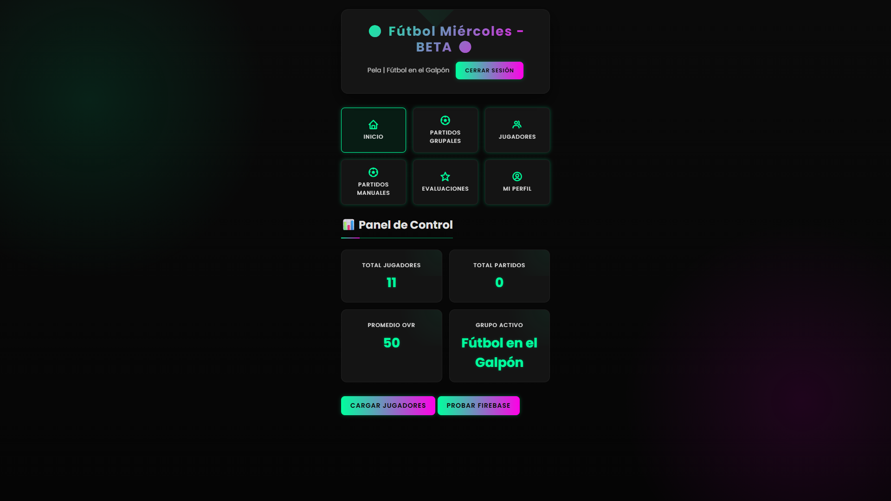

---

## App Principal - Navegación completa

**URL:** `http://localhost:5500/index.html`
**Documentado:** 2/9/2025, 4:48:18 p. m.

### 📸 Vista inicial

Vista inicial de App Principal - Navegación completa

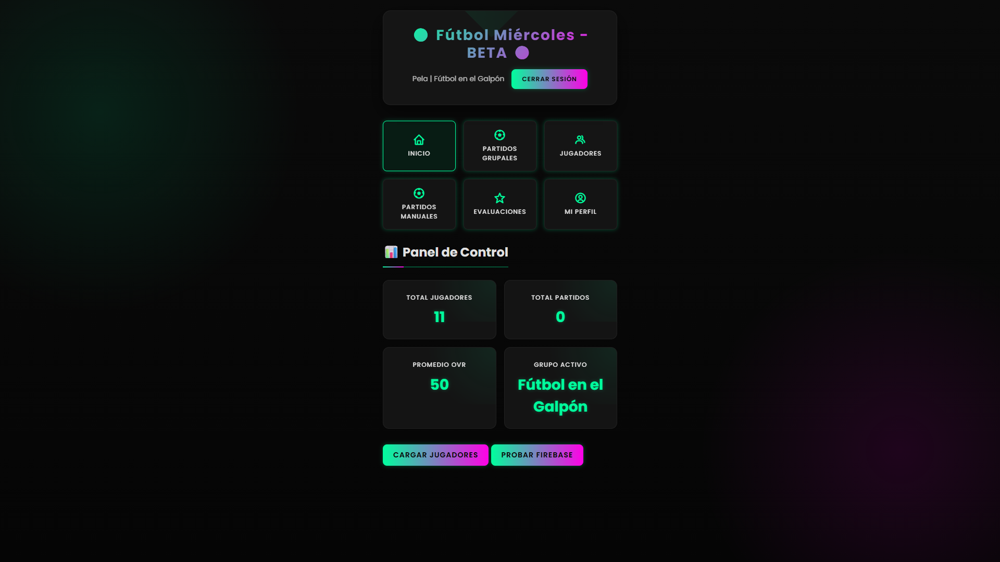

### 💫 Interacciones Documentadas

#### undefined ❌

undefined

**Error:** `Cannot read properties of undefined (reading 'toLowerCase')`

#### Navegar a Jugadores ✅

Clic en la pestaña de Jugadores

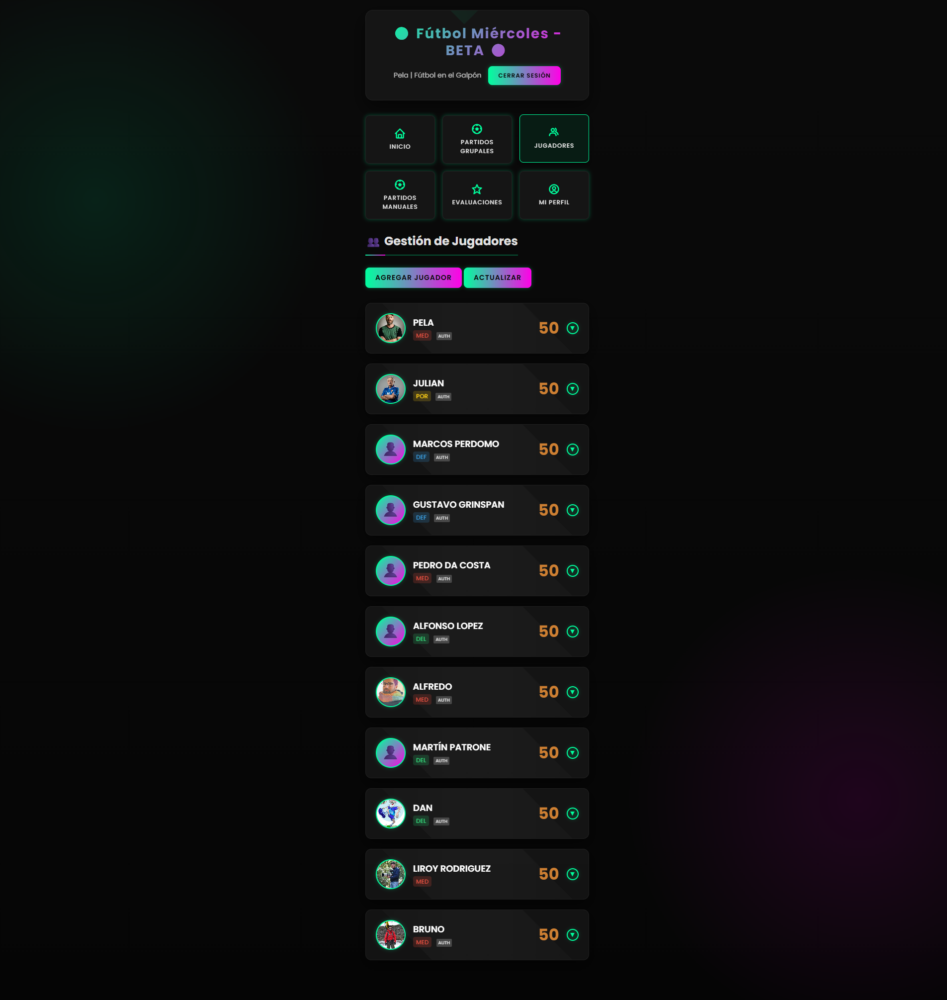

#### Navegar a Partidos ❌

Clic en la pestaña de Partidos

**Error:** `page.click: Timeout 30000ms exceeded.
Call log:
  - waiting for locator('.nav-btn[onclick*="match"], button[onclick*="match"], [data-screen="match"]')
    - locator resolved to 3 elements. Proceeding with the first one: <button onclick="TestApp.finishMatchFromHistory('match_1756840973635_7epcdw')">↵                                ✅ Finalizar↵    …</button>
  - attempting click action
    2 × waiting for element to be visible, enabled and stable
      - element is not visible
    - retrying click action
    - waiting 20ms
    - waiting for element to be visible, enabled and stable
    - element is not visible
  - retrying click action
    - waiting 100ms
  - element was detached from the DOM, retrying
    - waiting for" http://localhost:5500/index.html" navigation to finish...
    - navigated to "http://localhost:5500/index.html"
    - locator resolved to 3 elements. Proceeding with the first one: <button onclick="TestApp.finishMatchFromHistory('match_1756840973635_7epcdw')">↵                                ✅ Finalizar↵    …</button>
  - attempting click action
    2 × waiting for element to be visible, enabled and stable
      - element is not visible
    - retrying click action
    - waiting 20ms
    2 × waiting for element to be visible, enabled and stable
      - element is not visible
    - retrying click action
      - waiting 100ms
    31 × waiting for element to be visible, enabled and stable
       - element is not visible
     - retrying click action
       - waiting 500ms
  - element was detached from the DOM, retrying
    - locator resolved to 3 elements. Proceeding with the first one: <button onclick="TestApp.finishMatchFromHistory('match_1756840973635_7epcdw')">↵                                ✅ Finalizar↵    …</button>
  - attempting click action
    2 × waiting for element to be visible, enabled and stable
      - element is not visible
    - retrying click action
    - waiting 20ms
    2 × waiting for element to be visible, enabled and stable
      - element is not visible
    - retrying click action
      - waiting 100ms
    17 × waiting for element to be visible, enabled and stable
       - element is not visible
     - retrying click action
       - waiting 500ms
`

#### Navegar a Evaluaciones ❌

Clic en la pestaña de Evaluaciones

**Error:** `page.click: Timeout 30000ms exceeded.
Call log:
  - waiting for locator('.nav-btn[onclick*="evaluate"], button[onclick*="evaluate"], [data-screen="evaluate"]')
    - waiting for" http://localhost:5500/index.html" navigation to finish...
    - navigated to "http://localhost:5500/index.html"
`

#### Navegar a Historial ❌

Clic en la pestaña de Historial

**Error:** `page.click: Timeout 30000ms exceeded.
Call log:
  - waiting for locator('.nav-btn[onclick*="history"], button[onclick*="history"], [data-screen="history"]')
    - waiting for navigation to finish...
    - navigated to "http://localhost:5500/index.html"
`

---

## CPanel - Panel de Control

**URL:** `http://localhost:5500/cpanel.html`
**Documentado:** 2/9/2025, 4:50:13 p. m.

### 📸 Vista inicial

Vista inicial de CPanel - Panel de Control

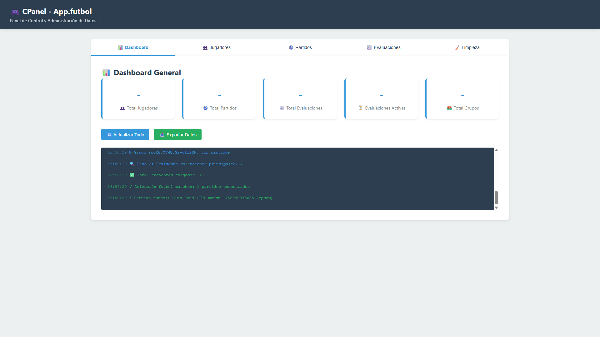

### 💫 Interacciones Documentadas

#### Carga del CPanel ✅

Esperar que el CPanel cargue completamente

#### Mostrar dashboard completo ✅

Scroll para mostrar todas las estadísticas del dashboard

---

## CPanel - Gestión de Datos

**URL:** `http://localhost:5500/cpanel.html`
**Documentado:** 2/9/2025, 4:50:34 p. m.

### 📸 Vista inicial

Vista inicial de CPanel - Gestión de Datos

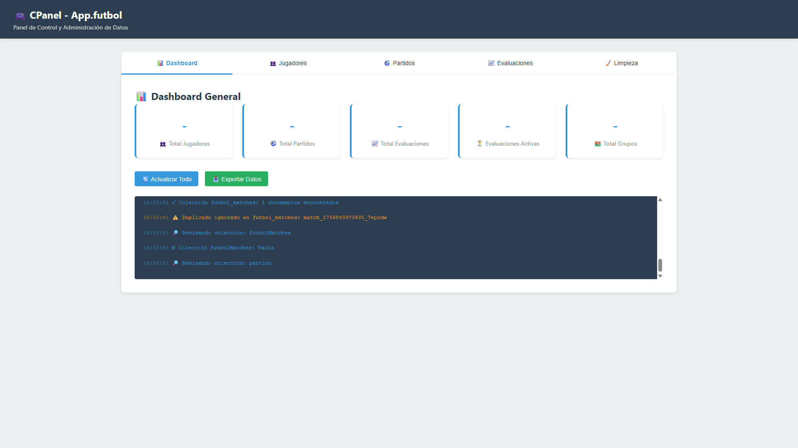

### 💫 Interacciones Documentadas

#### undefined ❌

undefined

**Error:** `Cannot read properties of undefined (reading 'toLowerCase')`

#### Pestaña Jugadores ✅

Navegar a gestión de jugadores

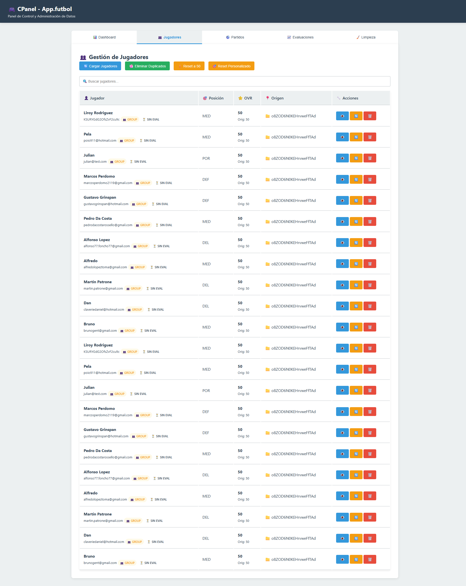

#### undefined ❌

undefined

**Error:** `Cannot read properties of undefined (reading 'toLowerCase')`

#### Pestaña Partidos ✅

Navegar a gestión de partidos

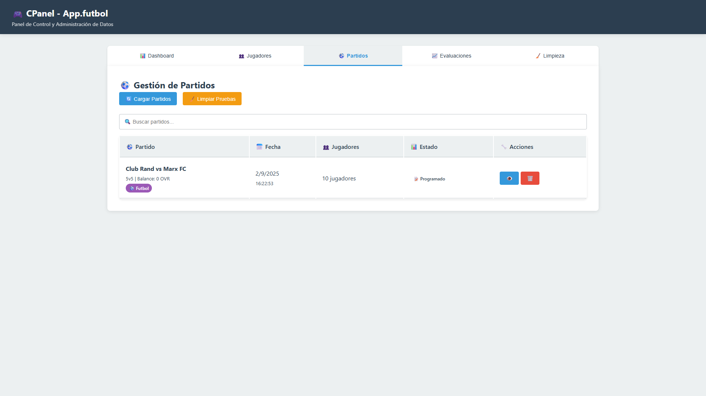

#### undefined ❌

undefined

**Error:** `Cannot read properties of undefined (reading 'toLowerCase')`

#### Pestaña Evaluaciones ✅

Navegar a gestión de evaluaciones

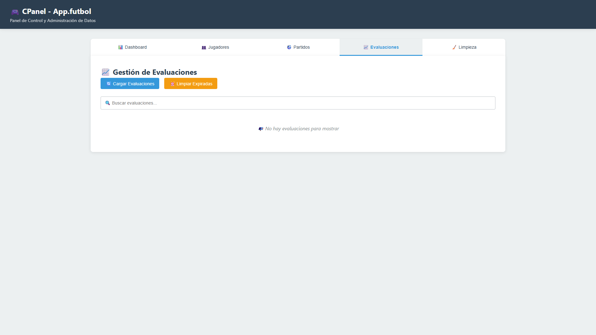

#### undefined ❌

undefined

**Error:** `Cannot read properties of undefined (reading 'toLowerCase')`

#### Pestaña Limpieza ✅

Navegar a herramientas de limpieza

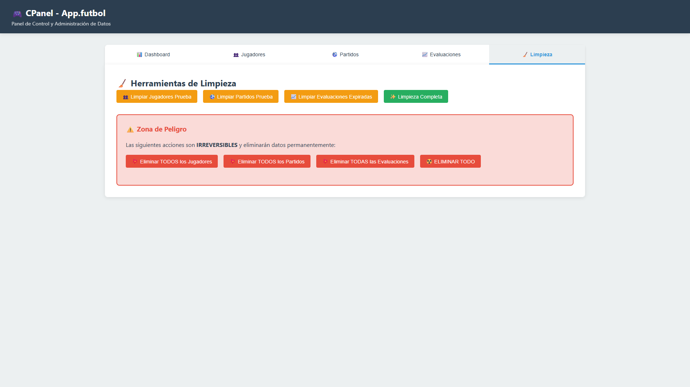

---

## Admin Panel - Administración

**URL:** `http://localhost:5500/admin.html`
**Documentado:** 2/9/2025, 4:51:26 p. m.

### 📸 Vista inicial

Vista inicial de Admin Panel - Administración

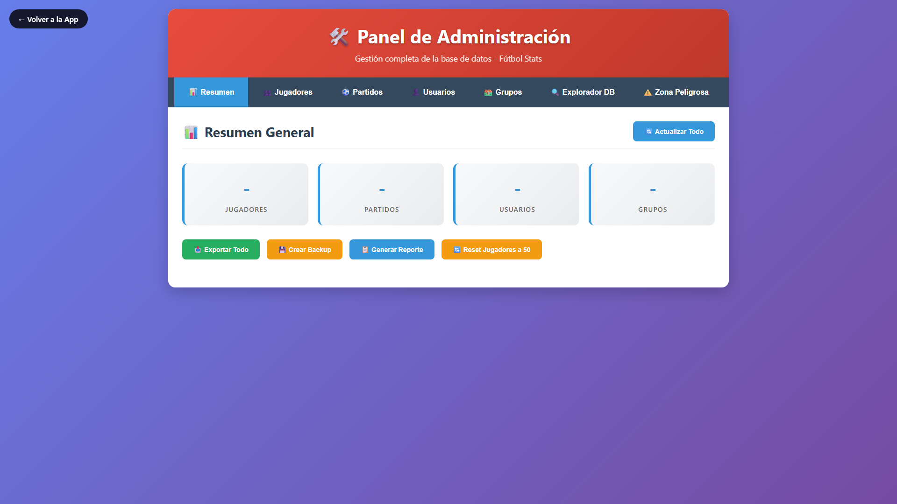

### 💫 Interacciones Documentadas

#### Carga del Admin Panel ✅

Esperar que el admin panel cargue

#### Explorar panel completo ✅

Mostrar todas las opciones administrativas

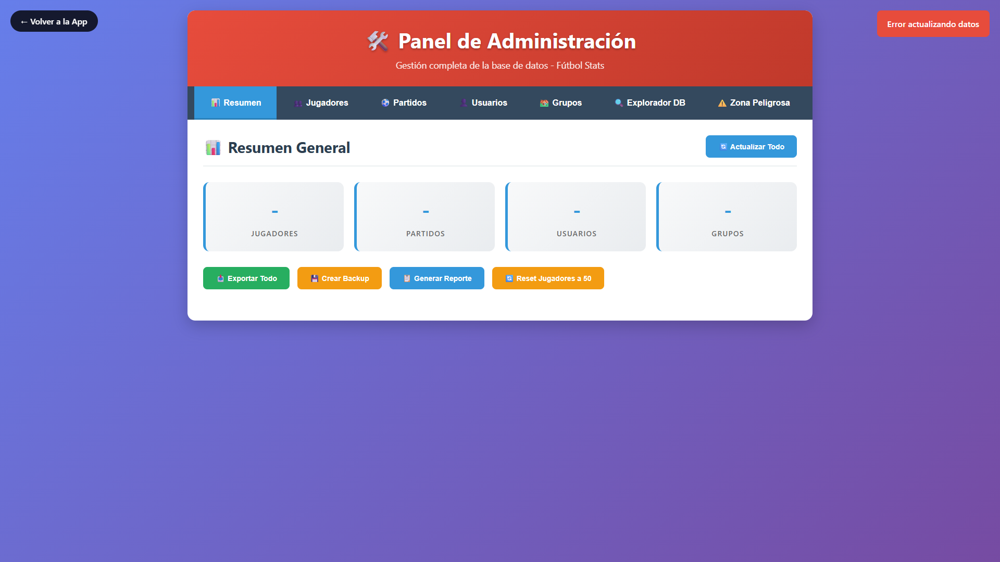

---

## Página de Configuración

**URL:** `http://localhost:5500/config.html`
**Documentado:** 2/9/2025, 4:51:45 p. m.

### 📸 Vista inicial

Vista inicial de Página de Configuración

### 💫 Interacciones Documentadas

#### Carga de página ✅

Cargar Página de Configuración

---

## Página de Ayuda

**URL:** `http://localhost:5500/help.html`
**Documentado:** 2/9/2025, 4:51:58 p. m.

### 📸 Vista inicial

Vista inicial de Página de Ayuda

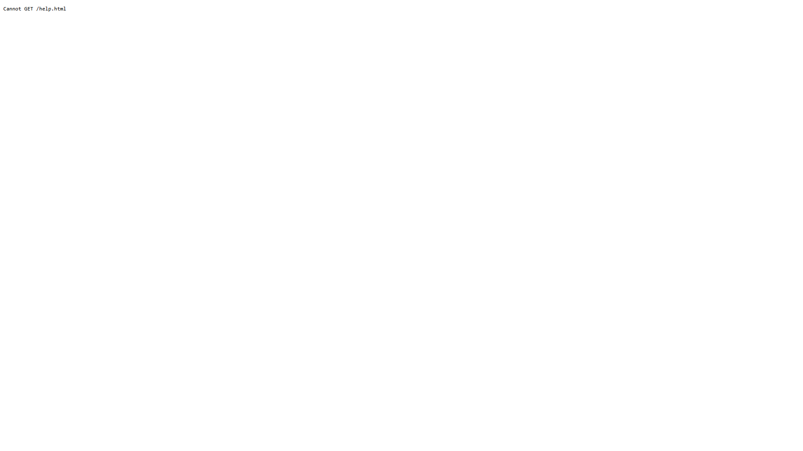

### 💫 Interacciones Documentadas

#### Carga de página ✅

Cargar Página de Ayuda

---

## Página de Login

**URL:** `http://localhost:5500/login.html`
**Documentado:** 2/9/2025, 4:52:11 p. m.

### 📸 Vista inicial

Vista inicial de Página de Login

### 💫 Interacciones Documentadas

#### Carga de página ✅

Cargar Página de Login

---

